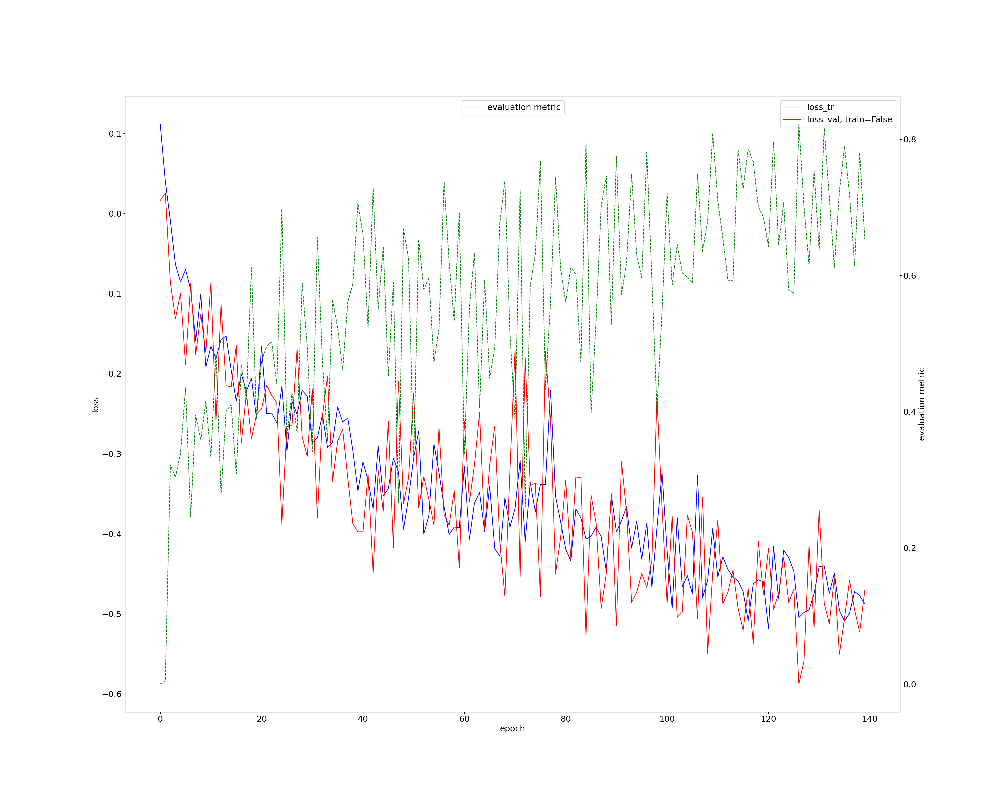

# Jan 21 2023
Finalizing PNET transfer learning + bootstrapping experiments.

## Overview
- Run finetuning on pretrained PNET model on TACE dataset
- Training another U-Net on predicted PNET segmentations

## Experiment 1: PNET Transfer learning
Task 606: Model using TACE plans, trained on PNET dataset
- 60-20-20 Train-Val-Test split

### Procedure
- Preprocess TACE dataset (done) `nnUNet_plan_and_preprocess -t <tacenum>`
- [Preprocess](experiment1/pn_transfer_preprocess.sh) PNET dataset using plans from TACE (done) `nnUNet_plan_and_preprocess -t <pnetnum> -overwrite_plans <tace_plans> -overwrite_plans_identifier <tacenum>`
- Train U-Net using plans from TACE dataset (done) `nnUNet_train 3d_fullres nnUNetTrainerV2 <pnet_taskname> all -p <pretrained_plan_name>`
  - Single-fold cross validation
  - DICE+CE loss
- Fine tune model on TACE dataset `nnUNet_train 3d_fullres nnUNetTrainerV2 <pnet_taskname> -pretrained_weights PATH_TO_MODEL_FINAL_CHECKPOINT`
  - 5-fold cross validation
  - DICE+CE loss

### Results
Initial loss curve on PNET (140 epochs) (replace this once training finishes)

## Experiment 2: PNET bootstrapping
**Context:** Initial PNET segmentations miss the largest lesion segmented by radiologist. Want to make it more sensitive to all lesions so it overlaps more frequently.

Task 602: U-Net trained directly on PNET dataset
- 60-20-20 train-test-val split

Task 610: U-Net trained on Task 602 predictions

### Procedure
- Preprocess **validation** images+segmentations from each fold on PNET task 602 (raw predictions before postprocessing)
  - TODO: doublecheck for data leakage?
- Keep test set+ground truth the same for bootstrapped dataset
- Train U-Net on predicted segmentations
