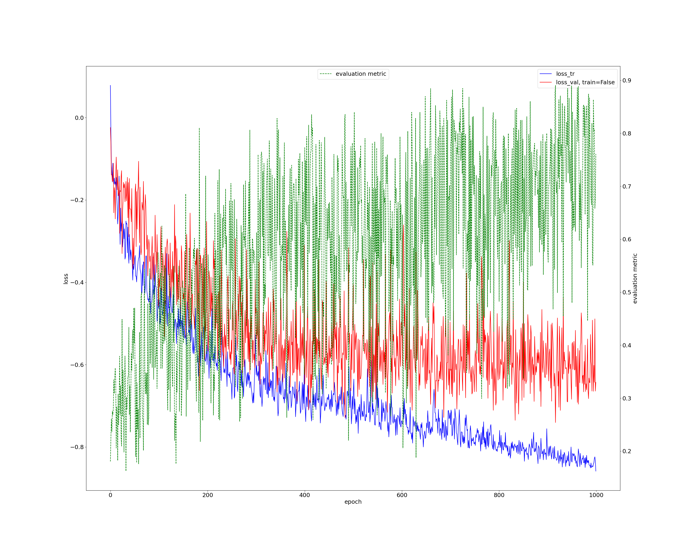
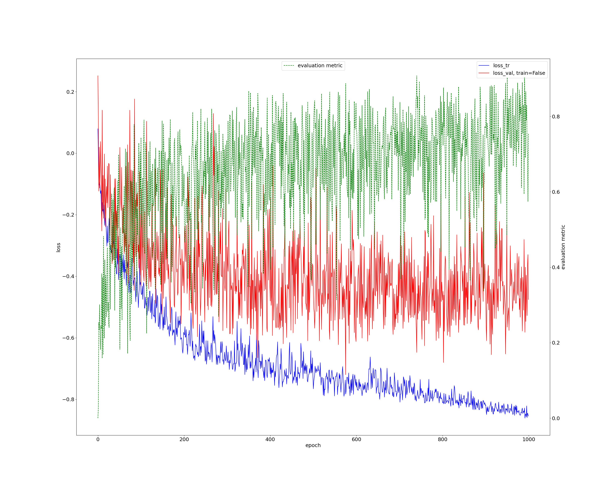

# Jan 21 2023
Finalizing PNET transfer learning + bootstrapping experiments.

## Overview
- Run finetuning on pretrained PNET model on TACE dataset
- Training another U-Net on predicted PNET segmentations

## Experiment 1: PNET Transfer learning
Task 606: Model using TACE plans, trained on PNET dataset
- 60-20-20 Train-Val-Test split

### Procedure
- Preprocess TACE dataset (done) `nnUNet_plan_and_preprocess -t <tacenum>`
- [Preprocess](experiment1/PNET/pn_transfer_preprocess.sh) PNET dataset using plans from TACE (done) `nnUNet_plan_and_preprocess -t <pnetnum> -overwrite_plans <tace_plans> -overwrite_plans_identifier <tacenum>`
- Train U-Net using plans from TACE dataset (done) `nnUNet_train 3d_fullres nnUNetTrainerV2 <pnet_taskname> all -p <pretrained_plan_name>`
  - Single-fold cross validation
  - DICE+CE loss
  - jobid `57082877`
- Fine tune model on TACE dataset `nnUNet_train 3d_fullres nnUNetTrainerV2 <pnet_taskname> -pretrained_weights PATH_TO_MODEL_FINAL_CHECKPOINT`
  - 5-fold cross validation
  - DICE+CE loss

### Results
DICE+CE loss curve on PNET. Less noisy compared to training directly on PNET?  

|        Dataset       | DICE |  FPR  | FNR | Hausdorff | 
| -------------------- | ---- | ----- | --- | --------- |
| Val                  | 0.50 | 8.6e-4| 0.36| TODO      |
| Test                 | TODO | TODO  | TODO| TODO      |
| Test (no TACE plans) | 0.52 | 8.5e-4| 0.39| 4.55      |
- Nearly the same performance on PNET when using TACE plans
## Experiment 2: PNET bootstrapping
**Context:** Initial PNET segmentations miss the largest lesion segmented by radiologist. Want to make it more sensitive to all lesions so it overlaps more frequently.

Task 602: U-Net trained directly on PNET dataset
- 60-20-20 train-test-val split

Task 610: U-Net trained on Task 602 predictions

### Procedure
- Preprocess **validation** images+segmentations from each fold on PNET task 602 (raw predictions before postprocessing)
  - TODO: doublecheck for data leakage?
  - jobid `57142719`
- Keep test set+ground truth the same for bootstrapped dataset
- Train U-Net on predicted segmentations
  - 5 fold cross validation
  - fold jobids: `57156577, 57156578, 57156583, 57156584, 57156585`

### Results
Training on PNET segmentations again:
| Fold 0| Fold 1 | Fold 2| Fold 3 | Fold 4 |
|-------|--------|-------|--------|--------|
|||||
- roughly the same performance over each fold for evaluation metric

Evaluation metric performance:
|        Dataset       | DICE | FPR   | FNR | Hausdorff |
| -------------------- | ---- | ----- | --- | --------- |
| Fold 0               | 0.30 | 5.1e-4| 0.66| TODO      | 
| Fold 1               | 0.44 | 3.5e-4| 0.55| TODO      | 
| Fold 2               | 0.38 | 8.9e-4| 0.54| TODO      | 
| Fold 3               | 0.31 | 1.9e-3| 0.50| TODO      | 
| Fold 4               | 0.35 | 3.2e-4| 0.58| TODO      | 
| Test                 | TODO | TODO  |TODO | TODO      |
| Test (On PNET only)  | 0.52 | 8.5e-4| 0.39| 4.55      |
- Note evaluation metrics are computed on predicted PNET segmentations
- Might want to compute them over connected bodies overlapping w/ radiologist segmented tumor

