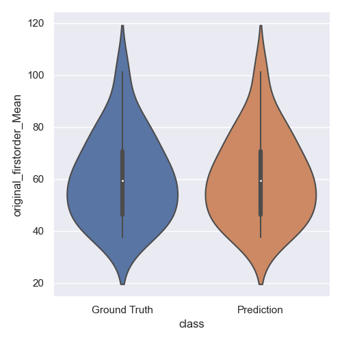
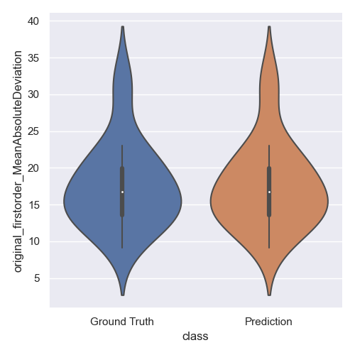
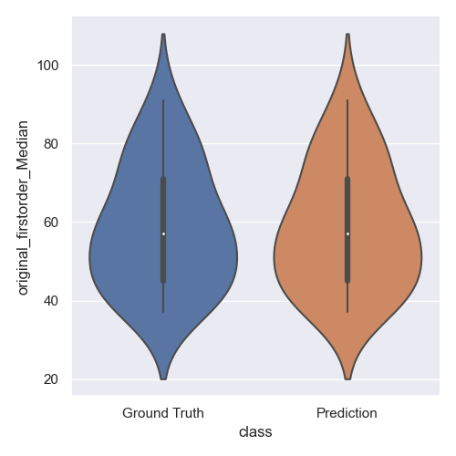
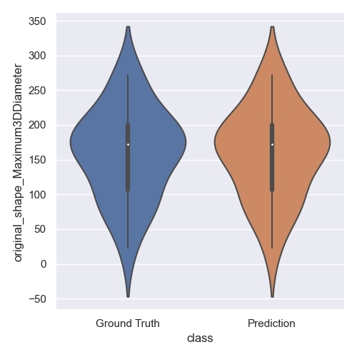
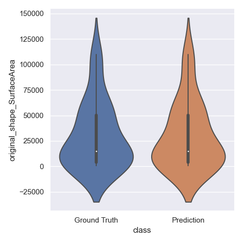
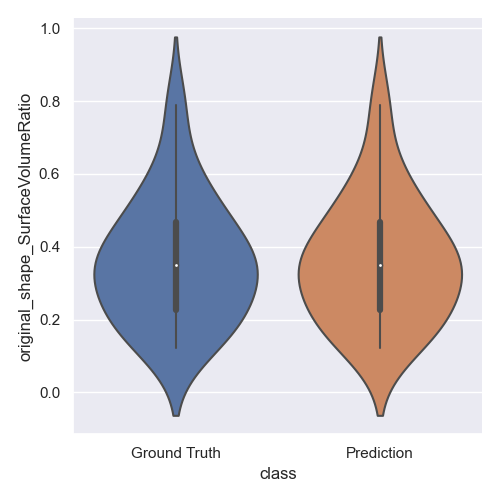

# Feb 15 2023

Running feature extraction on ground truth and predicted segmentations

## Overview
- pyradiomics on ground truth and predicted segmentations
- visualization of the distribution of each feature

## Pyradiomics

### Procedure
- Collect test set segmentations from ground truth and Task606 (TACE predictions)
- Run pyradiomics on default settings with masked test images `pyradiomics masks.csv -o results.csv -f csv`

### Results
- See `tace_gt_results.csv` and TACE_stitch_results.csv for raw data
- distribution of features same across test and ground truth datasets:

|  |  |  |
| --------------------------------- | -------------------------------------------------- | ----------------------------------- |
|  |  | |
