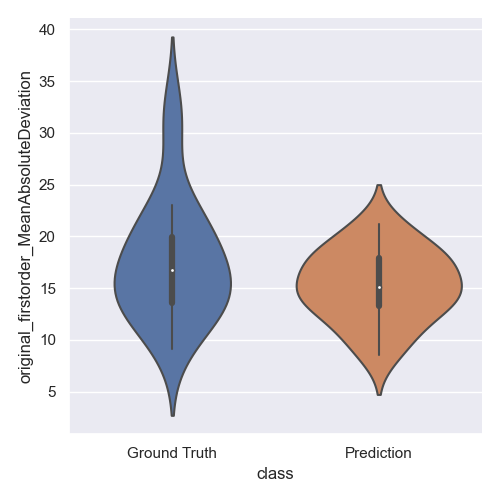

# Feb 15 2023

Running+analyzing feature extraction on ground truth and predicted segmentations
- Code used to produce visualizations can be found in `viz.py`
## Overview
- pyradiomics on ground truth and predicted segmentations
- visualization and analysis of the distribution of each feature

## Pyradiomics

### Procedure
- Collect test set segmentations from ground truth and Task606 (TACE predictions)
- Run pyradiomics on default settings with masked test images `pyradiomics masks.csv -o results.csv -f csv`

### Results (Distribution)
- See `tace_gt_results.csv` and TACE_stitch_results.csv for raw data

The distribution of features are similar on most first-order features:
|  |  |  |
| --------------------------------- | -------------------------------------------------- | ----------------------------------- |

Distribution differs slightly on shape features:
- Related to failure cases on segmentations

|  |  | |
| --------------------------------- | -------------------------------------------------- | ----------------------------------- |

Different distributions for gray level-related features:
- Most cases have a KL divergence of $\infty$

| |  | |
| --------------------------------- | -------------------------------------------------- | ----------------------------------- |

### KL Divergence
Histogram shows distribution of KL divergence (X axis) between ground truth and predicted features
- Computed as $KL(GT || Pred)$
- Note: $\infty$ is replaced with $-1$ in this histogram
- Raw results can be found in `pyradiomics_raw/kl_div.json`

Cases which score $\infty$:
- `diagnostics_Mask-original_VolumeNum
original_shape_MajorAxisLength
original_shape_Maximum2DDiameterSlice
original_shape_Maximum3DDiameter
original_firstorder_Energy
original_firstorder_Maximum
original_firstorder_Range
original_firstorder_Skewness
original_firstorder_TotalEnergy
original_glcm_ClusterProminence
original_glcm_ClusterShade
original_glcm_Idmn
original_gldm_LargeDependenceLowGrayLevelEmphasis
original_gldm_LowGrayLevelEmphasis
original_glrlm_GrayLevelNonUniformity
original_glrlm_LongRunLowGrayLevelEmphasis
original_glrlm_LowGrayLevelRunEmphasis
original_glrlm_RunLengthNonUniformity
original_glrlm_ShortRunLowGrayLevelEmphasis
original_glszm_GrayLevelNonUniformity
original_glszm_GrayLevelNonUniformityNormalized
original_glszm_GrayLevelVariance
original_glszm_SmallAreaLowGrayLevelEmphasis
original_ngtdm_Complexity
original_ngtdm_Strength`
