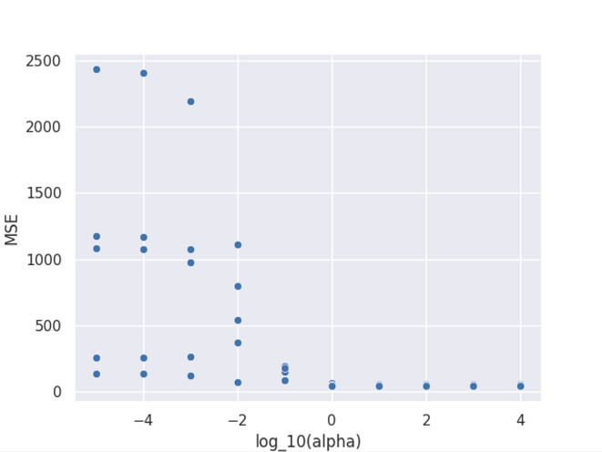
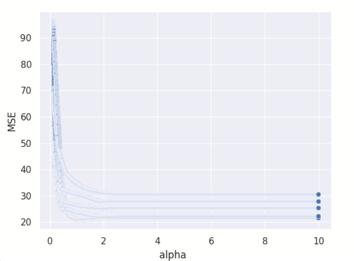
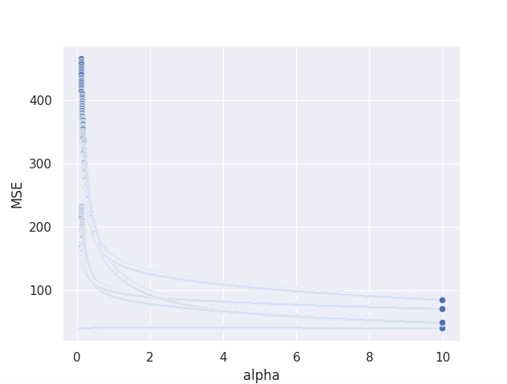

# Mar 1 2023

Evaluating different feature selection algorithms

## Overview
- Run lasso, ridge, and elastic net regression on training set segmentations
- Analysis of selected features
- Visualization and feature selection code can be found in [feature_selection.py](feature_selection.py)

## TODO
- Run ridge, elastic net, PCA?
- Some features are [correlated](gt_correlation.png), whiten data?
## Feature Selection (Lasso)
### Procedure

We use lasso regression with the following objective function:
$$\frac{1}{2N}\lVert \mathbf{Xw} - \mathbf{y} \rVert_2^2 + \alpha \lVert \mathbf{w} \rVert_1$$
- Apply 5-fold cross validation to training set
- Standardize features
- Perform grid search over $\alpha$ values
- Run for a maximum of 1000 iterations of **coordinate descent**
- Evaluate performance with MSE
- **Targets:** overall survival in months

### Choosing initial range of $\alpha$
- Vary $\alpha$ by orders of magnitude
- Chosen values: `[1e-05, 0.0001, 0.001, 0.01, 0.1, 1, 10, 100, 1000, 10000]`

MSE on validation set of each fold over alpha values:

- MSE increases the lower we set alpha
- MSE doesn't increase after $\alpha > 10$ 
- $\ell_1$ term seems to contribute more to objective than the data loss after this point:
  - $\ell_1$ norm of each fold after training shown below:
    | $\alpha$ | fold 1 | fold 2  | fold 3 | fold 4 | fold 5 |
    | -------- | ------ | ------- | ------ | ------ | ------ |
    | 1e-05    | 790.49 | 706.76  | 671.37 | 606.33 | 755.44 |
    | 0.0001   | 783.19 | 699.22  | 665.42 | 599.04 | 747.59 |
    | 0.001    | 711.90 | 637.507 | 606.72 | 530.07 | 637.85 |
    | 0.01     | 313.01 | 283.54  | 237.60 | 259.62 | 335.91 |
    | 0.1      | 48.96  | 44,33   | 34.237 | 54.72  | 56.32  |
    | 1        | 2.17   | 2.95    | 3.39   | 2.86   | 2.66   |
    | 10       | 0      | 0       | 0      | 0      | 0      |
    | 100      | 0      | 0       | 0      | 0      | 0      |
    | 1000     | 0      | 0       | 0      | 0      | 0      |
    | 10000    | 0      | 0       | 0      | 0      | 0      |

- **Note:** Most of the models with $\alpha \leq 0.1$ did not converge

Thus we choose a range of $[0.1, 10]$ based on this result

### Searching $\alpha$ in $[0.1, 10]$
We repeat the last step but instead on the range of $[0.1, 10]$, with increments of `0.001`. Below is the MSE on validation set of each fold over these alpha values:

Choosing the minimum mean MSE over all folds, we get the following:
- $\alpha$: `1.955`
- **Mean MSE** over all folds: `25.5164`
- MSE of each fold: `[21.67660596 27.67872614 31.15366727 25.12220249 21.95091332]`
- $\ell_1$ term of each fold: `[0.2329744  0.33812461 0.9254112  0.46833511 0.68787499]`

Next we take the mean of the model weights over each fold, and select weights which are > 0. This gives us the following indices:
- `[6, 7, 9, 15, 16, 76, 83, 104]`

This corresponds to the following 8 features:
- `'original_shape_Elongation'` 
- `'original_shape_Flatness'` 
- `'original_shape_MajorAxisLength'`
- `'original_shape_MinorAxisLength'` 
- `'original_shape_Sphericity'` 
- `'original_glrlm_GrayLevelNonUniformity'` 
- `'original_glrlm_LowGrayLevelRunEmphasis'`
- `'original_glszm_SmallA`

On a different run, we get the same value for $\alpha$ and MSE, but with the following features:
- `'original_shape_Flatness'`
- `'original_shape_LeastAxisLength'`
- `'original_shape_Maximum2DDiameterColumn'`
- `'original_shape_Sphericity'`
- `'original_shape_SurfaceArea'`
- `'original_glrlm_GrayLevelNonUniformityNormalized'`
- `'original_glrlm_RunEntropy'`
- `'original_glszm_ZoneEntropy'`

Some features are reused, roughly same classes of features (mostly shape and texture features)

### Features at higher $\alpha$
$\alpha=2.1$ (6 Features):
- `'original_shape_LeastAxisLength' `
- `'original_shape_Maximum2DDiameterColumn'`
- `'original_shape_Sphericity' `
- `'original_shape_SurfaceArea'`
- `'original_glrlm_GrayLevelNonUniformityNormalized'`
- `'original_glrlm_RunEntropy'`

$\alpha=2.2$ (4 features):
- `'original_shape_LeastAxisLength' `
- `'original_shape_Maximum2DDiameterColumn'`
- `'original_shape_SurfaceArea' `
- `'original_glrlm_RunEntropy'`

$\alpha \in [2.3, 2.9]$:
- `'original_shape_LeastAxisLength'`

No features selected after this point

### Concordance Index
Concordance index on each validation fold:
- `0.525, 0.63865546, 0.55833333, 0.68067227, 0.50833333`
- Average: `0.5821989`
- Slightly better than randomly guessing

## Feature Selection (Ridge)

### Procedure
Uses the following objective function:
$$\frac{1}{2N}\lVert \mathbf{Xw} - \mathbf{y} \rVert_2^2 + \alpha \lVert \mathbf{w} \rVert_2^2$$
- same as procedure for lasso regression (see previous section)

### Searching $\alpha$

- MSE keeps decreasing with larger $\alpha$ past 10
- Feature weights are not as sparse as lasso
- skipped this method